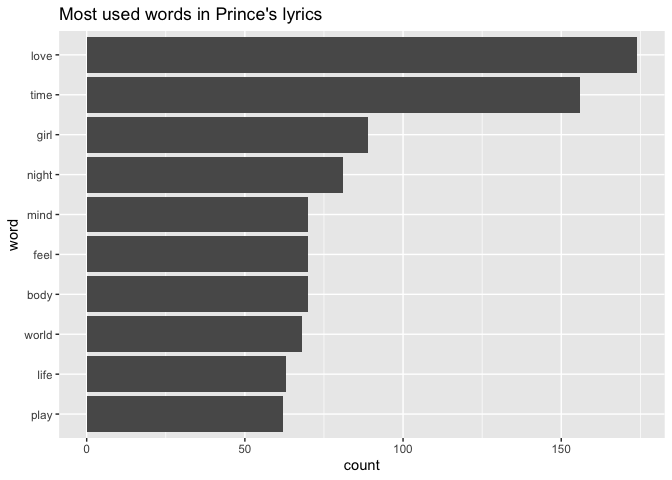

Load the libraries and the data
-------------------------------

    #most of the libraries needed

    library(dplyr) #data manipulation

    ## 
    ## Attaching package: 'dplyr'

    ## The following objects are masked from 'package:stats':
    ## 
    ##     filter, lag

    ## The following objects are masked from 'package:base':
    ## 
    ##     intersect, setdiff, setequal, union

    library(ggplot2) #visualizations
    library(gridExtra) #viewing multiple plots together

    ## 
    ## Attaching package: 'gridExtra'

    ## The following object is masked from 'package:dplyr':
    ## 
    ##     combine

    library(tidytext) #text mining
    library(wordcloud2) #creative visualizations
    library(tidyr)

    d0 <- read.csv("prince_raw_data.csv", stringsAsFactors = F)

    prince <- d0 %>% 
      select(lyrics = text, song, year, album, peak, us_pop = US.Pop, us_rnb = US.R.B)

Condition the data
------------------

    # Clean up contractions
    fix.contractions <- function(doc) {
      # "won't" is a special case as it does not expand to "wo not"
      doc <- gsub("won't", "will not", doc)
      doc <- gsub("can't", "can not", doc)
      doc <- gsub("n't", " not", doc)
      doc <- gsub("'ll", " will", doc)
      doc <- gsub("'re", " are", doc)
      doc <- gsub("'ve", " have", doc)
      doc <- gsub("'m", " am", doc)
      doc <- gsub("'d", " would", doc)
      # 's could be 'is' or could be possessive: it has no expansion
      doc <- gsub("'s", "", doc)
      return(doc)
    }

    prince$lyrics <- sapply(prince$lyrics, fix.contractions)

    # function to remove special characters
    removeSpecialChars <- function(x) gsub("[^a-zA-Z0-9 ]", " ", x)
    # remove special characters
    prince$lyrics <- sapply(prince$lyrics, removeSpecialChars)

    # convert everything to lower case
    prince$lyrics <- sapply(prince$lyrics, tolower)

### Create decade, chart\_level, and charted variables

    prince <- prince %>%
      mutate(decade =
               ifelse(
                 prince$year %in% 1978:1979,
                 "1970s",
                 ifelse(
                   prince$year %in% 1980:1989,
                   "1980s",
                   ifelse(
                     prince$year %in% 1990:1999,
                     "1990s",
                     ifelse(
                       prince$year %in% 2000:2009,
                       "2000s",
                       ifelse(prince$year %in% 2010:2015, "2010s",
                              "NA")
                     )
                   )
                 )
               ))

    #create the chart level column
    prince <- prince %>%
      mutate(chart_level = 
               ifelse(prince$peak %in% 1:10, "Top 10", 
                      ifelse(prince$peak %in% 11:100, "Top 100", "Uncharted")))

    #create binary field called charted showing if a song hit the charts at all
    prince <- prince %>%
      mutate(charted = 
               ifelse(prince$peak %in% 1:100, "Charted", "Uncharted"))

Prepare for tokenizing
----------------------

    undesirable_words <- c(
      "prince",
      "chorus",
      "repeat",
      "lyrics",
      "theres",
      "bridge",
      "fe0f",
      "yeah",
      "baby",
      "alright",
      "wanna",
      "gonna",
      "chorus",
      "verse",
      "whoa",
      "gotta",
      "make",
      "miscellaneous",
      "2",
      "4",
      "ooh",
      "uurh",
      "pheromone",
      "poompoom",
      "3121",
      "matic",
      " ai ",
      " ca ",
      " la ",
      "hey",
      " na ",
      " da ",
      " uh ",
      " tin ",
      "  ll",
      "transcription",
      "repeats"
    )

Tokenize words
--------------

    t <- prince %>% 
      unnest_tokens(word, lyrics) %>%
      anti_join(stop_words) %>%
      filter(!word %in% undesirable_words) %>%
      distinct() %>%
      filter(nchar(word) > 3)

    ## Joining, by = "word"

    head(sample(t$word, 20), 20)

    ##  [1] "floor"    "party"    "cheese"   "brutal"   "night"    "play"    
    ##  [7] "sweet"    "ecstasy"  "compton"  "drop"     "live"     "passing" 
    ## [13] "granny"   "accessed" "dozen"    "disputes" "matter"   "eternal" 
    ## [19] "sleep"    "game"

Analysis
========

What words are most used in all his songs?
------------------------------------------

    t %>%
      filter(decade != "NA") %>%
      group_by(word) %>%
      summarize(count = n()) %>% 
      top_n(10) %>%
      arrange(desc(count)) %>% 
      mutate(word = reorder(word, count)) %>%
      ggplot() + aes(x = word, y = count) +
      geom_col() + ggtitle("Most used words in Prince's lyrics") +
      coord_flip()

    ## Selecting by count

Can we predict which album based on the word?
---------------------------------------------
